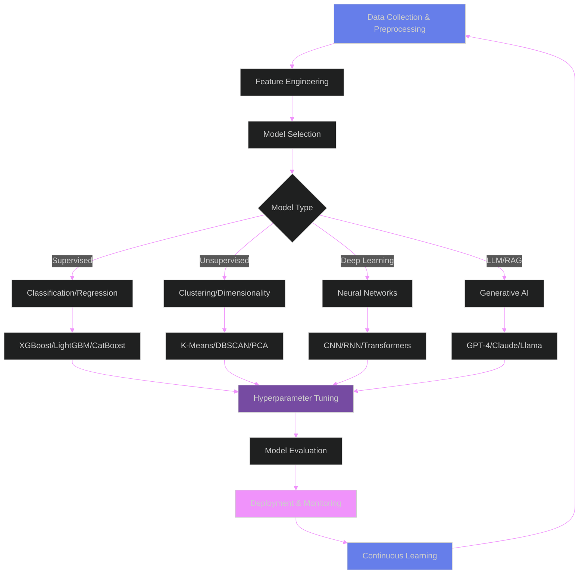

<div align="center">


[](https://git.io/typing-svg)

</div>

<div align="center">

[](mailto:alansabujohn@gmail.com)
[](https://www.linkedin.com/in/alan-sabu-john-b38255202)
[](https://twitter.com/alan_45797)
[](https://portfolio-git-main-alen-s-js-projects.vercel.app/)
[](./Alan_Sabu_John.pdf)


</div>

---

## 🎯 Professional Summary

<div align="center">

```ascii
╔════════════════════════════════════════════════════════════════════════════╗
║                    AI/ML ENGINEER & RESEARCHER PROFILE                     ║
╠════════════════════════════════════════════════════════════════════════════╣
║                                                                            ║
║  🔬 ML Research    │  🤖 LLM Systems    │  📊 Data Analytics              ║
║  ━━━━━━━━━━━━━━━━━│━━━━━━━━━━━━━━━━━━━│━━━━━━━━━━━━━━━━━━━━━━━             ║
║  • NLP & CV       │  • RAG Pipelines   │  • Predictive Models              ║
║  • Deep Learning  │  • Agent Systems   │  • BI Dashboards                  ║
║  • Model Tuning   │  • Vector DBs      │  • Statistical Analysis           ║
║                                                                            ║
╚════════════════════════════════════════════════════════════════════════════╝
```

</div>

> **Specialization:** Designing production-grade AI/ML systems combining deep learning, large language models, retrieval augmented generation, computer vision, and advanced analytics to deliver measurable business impact.

---

## 🏆 GitHub Trophies

<div align="center">

[](https://github.com/ryo-ma/github-profile-trophy)

</div>

---

## 📊 GitHub Statistics & Contributions

<div align="center">


</div>

<div align="center">

[](https://git.io/streak-stats)

</div>

<div align="center">


</div>

---

## 🎓 Achievements & Recognition

<div align="center">

| 🏅 Achievement | 📝 Description | 📅 Year |
|:--------------|:---------------|:--------|
| 🥇 **Top ML Contributor** | Government AI research initiatives | 2024 |
| 🎖️ **Academic Publication** | NLP & Computer Vision systems research | 2023-24 |
| 🏆 **Innovation Award** | Advanced RAG system deployment | 2024 |
| ⭐ **Open Source Contributor** | LangChain, Hugging Face ecosystems | 2023-24 |
| 🎯 **70%+ Accuracy Gains** | Production ML model optimization | 2023 |
| 💡 **AI Solution Architect** | End-to-end ML pipeline design | 2022-24 |

</div>

---

## 💼 LinkedIn Profile Insights

<div align="center">

[](https://www.linkedin.com/in/alan-sabu-john-b38255202)

**Connect with me on LinkedIn for:**
- 🔬 ML Research Updates & Publications
- 💼 Professional Collaborations
- 📚 Technical Articles & Insights
- 🎯 AI/ML Industry Trends

[](https://www.linkedin.com/in/alan-sabu-john-b38255202)

</div>

---

## 🛠️ Technical Arsenal & ML Models

<div align="center">

### **🤖 AI/ML Frameworks & Libraries**


### **🧠 Large Language Models & NLP**


### **🔍 Vector Databases & Embedding Models**


### **👁️ Computer Vision & Object Detection**


### **📊 Data Science & Analytics Stack**


### **🚀 MLOps & Deployment**


### **☁️ Cloud Platforms & Databases**


</div>

---

## 🔬 ML Research & Model Architecture

<div align="center">



</div>

### 🎯 ML Model Expertise

<table align="center">
<tr>
<td align="center" width="25%">

**🔵 Supervised Learning**
```python
models = {
  "Classification": [
    "Random Forest",
    "XGBoost",
    "LightGBM",
    "Neural Nets"
  ],
  "Regression": [
    "Linear/Ridge",
    "Gradient Boost",
    "Deep Learning"
  ]
}
```

</td>
<td align="center" width="25%">

**🟣 Deep Learning**
```python
architectures = {
  "NLP": [
    "BERT",
    "GPT",
    "T5",
    "RoBERTa"
  ],
  "Vision": [
    "ResNet",
    "EfficientNet",
    "Vision Trans."
  ]
}
```

</td>
<td align="center" width="25%">

**🟢 Unsupervised**
```python
techniques = {
  "Clustering": [
    "K-Means",
    "DBSCAN",
    "Hierarchical"
  ],
  "Reduction": [
    "PCA",
    "t-SNE",
    "UMAP"
  ]
}
```

</td>
<td align="center" width="25%">

**🟡 Reinforcement**
```python
algorithms = {
  "Model-Free": [
    "Q-Learning",
    "DQN",
    "PPO"
  ],
  "Model-Based": [
    "MCTS",
    "AlphaZero"
  ]
}
```

</td>
</tr>
</table>

---

## 📈 Data Analytics & BI Dashboards

<div align="center">

```ascii
╔══════════════════════════════════════════════════════════════════════════╗
║                     DATA ANALYTICS PIPELINE ARCHITECTURE                 ║
╠══════════════════════════════════════════════════════════════════════════╣
║                                                                          ║
║  ┌─────────────┐    ┌──────────────┐    ┌────────────────┐               ║
║  │   Extract   │───▶│  Transform   │───▶│     Load       │              ║
║  │   (ETL)     │    │  (Process)   │    │  (Warehouse)   │               ║
║  └─────────────┘    └──────────────┘    └────────────────┘               ║
║         │                   │                     │                      ║
║         ▼                   ▼                     ▼                      ║
║  [APIs/DBs/Files]    [Data Quality]       [SQL/NoSQL]                    ║
║  [Web Scraping]      [Feature Eng]        [Data Lake]                    ║
║  [IoT Streams]       [Aggregation]        [Cloud Store]                  ║
║                                                  │                       ║
║                                                  ▼                       ║
║                                          ┌──────────────┐                ║
║                                          │  Analytics   │                ║
║                                          │  & Insights  │                ║
║                                          └──────────────┘                ║
║                                                  │                       ║
║                     ┌────────────────────────────┼────────────┐          ║
║                     ▼                            ▼            ▼          ║
║              [Power BI]                   [Streamlit]   [Plotly]         ║
║              [Tableau]                    [Dash Apps]   [Custom UI]      ║
║                                                                          ║
╚══════════════════════════════════════════════════════════════════════════╝
```

</div>

### 📊 Analytics Capabilities

- ✅ **Descriptive Analytics:** Historical data analysis, KPI tracking, trend identification
- ✅ **Diagnostic Analytics:** Root cause analysis, correlation studies, anomaly detection
- ✅ **Predictive Analytics:** Forecasting, regression models, time series analysis
- ✅ **Prescriptive Analytics:** Optimization algorithms, recommendation systems, decision support
- ✅ **Real-time Analytics:** Streaming data processing, live dashboards, alert systems

---

## 🚀 Featured AI/ML Projects

<div align="center">

### 🌟 Production Systems & Research Projects

</div>

| Project | Category | Tech Stack | Highlights | Metrics | Status |
|:--------|:---------|:-----------|:-----------|:--------|:------:|
| **🤖 Multi-Agent RAG System** | LLM/RAG | LangChain • GPT-4 • Pinecone • Redis | Autonomous agents, tool orchestration, conversation memory | 70%+ accuracy | 🟢 Live |
| **📊 Predictive Analytics Suite** | ML/Analytics | XGBoost • Prophet • Streamlit | Time series forecasting, anomaly detection, auto-reporting | 85% F1-Score | 🟢 Live |
| **👁️ Vision Intelligence Platform** | Computer Vision | YOLOv8 • OpenCV • FastAPI • Docker | Real-time object detection, OCR, video analytics | 92% mAP | 🟢 Live |
| **🗃️ Multimodal Retrieval System** | ML Research | CLIP • LlamaIndex • Qdrant | Image+Text search, hybrid embeddings | 78% recall | 🟡 Beta |
| **💬 NLP Chatbot Framework** | NLP/LLM | BERT • Rasa • Transformers | Intent classification, entity extraction, context handling | 89% accuracy | 🟢 Live |
| **📈 BI Dashboard Generator** | Data Analytics | Power BI • Python • SQL | Automated dashboard creation, KPI monitoring | 15+ dashboards | 🟢 Live |
| **🔍 Semantic Search Engine** | NLP/Embedding | Sentence-BERT • FAISS • Flask | Dense retrieval, re-ranking, query expansion | 0.12s latency | 🟢 Live |
| **🧪 AutoML Pipeline** | MLOps | Optuna • MLflow • Scikit-learn | Hyperparameter tuning, experiment tracking, model registry | 3x faster | 🟢 Live |
| **📝 Document Intelligence** | OCR/NLP | LayoutLM • EasyOCR • spaCy | Form extraction, table detection, entity linking | 94% accuracy | 🟢 Live |
| **🎯 Recommendation Engine** | ML | Collaborative Filtering • ALS • TensorFlow | Personalization, cold-start handling, A/B testing | 0.78 NDCG | 🟢 Live |

---

## 💡 Core Competencies & Research Areas

<details open>
<summary><b>🧠 Large Language Models & Generative AI</b></summary>
<br/>

- ✅ **Model Fine-tuning:** LoRA, QLoRA, PEFT techniques for domain adaptation
- ✅ **Prompt Engineering:** Zero-shot, few-shot, chain-of-thought, ReAct patterns
- ✅ **RAG Systems:** Dense retrieval, hybrid search, re-ranking, query decomposition
- ✅ **Agent Frameworks:** LangChain agents, AutoGPT, multi-agent orchestration
- ✅ **LLM Evaluation:** BLEU, ROUGE, BERTScore, human evaluation protocols
- ✅ **Deployment:** API optimization, caching strategies, cost management

</details>

<details open>
<summary><b>🔬 Machine Learning Research & Development</b></summary>
<br/>

- ✅ **Deep Learning:** CNNs, RNNs, Transformers, GANs, VAEs, attention mechanisms
- ✅ **NLP:** Named Entity Recognition, sentiment analysis, text classification, summarization
- ✅ **Computer Vision:** Object detection, segmentation, image classification, video analysis
- ✅ **Model Optimization:** Quantization, pruning, knowledge distillation, mixed precision
- ✅ **Research Publications:** Academic papers on NLP and CV systems
- ✅ **Experimentation:** A/B testing, statistical significance, experimental design

</details>

<details open>
<summary><b>📊 Data Analytics & Business Intelligence</b></summary>
<br/>

- ✅ **Statistical Analysis:** Hypothesis testing, regression, ANOVA, time series
- ✅ **Data Visualization:** Interactive dashboards, storytelling with data, executive reports
- ✅ **SQL Mastery:** Complex queries, window functions, CTEs, query optimization
- ✅ **ETL Development:** Data pipelines, orchestration, data quality monitoring
- ✅ **Predictive Modeling:** Forecasting, classification, clustering, anomaly detection
- ✅ **BI Tools:** Power BI, Tableau, Streamlit, Plotly, custom dashboards

</details>

<details open>
<summary><b>🛠️ MLOps & Production ML</b></summary>
<br/>

- ✅ **Model Deployment:** REST APIs, batch inference, real-time serving
- ✅ **Monitoring:** Model drift detection, performance tracking, alerting systems
- ✅ **Containerization:** Docker, Kubernetes, orchestration, scaling
- ✅ **CI/CD:** Automated testing, deployment pipelines, version control
- ✅ **Experiment Tracking:** MLflow, Weights & Biases, model registry
- ✅ **Cloud Platforms:** AWS SageMaker, Azure ML, GCP Vertex AI

</details>

<details open>
<summary><b>👁️ Computer Vision & OCR</b></summary>
<br/>

- ✅ **Object Detection:** YOLO, Faster R-CNN, RetinaNet, custom model training
- ✅ **Image Segmentation:** U-Net, Mask R-CNN, semantic/instance segmentation
- ✅ **OCR Solutions:** Tesseract, EasyOCR, PaddleOCR, handwriting recognition
- ✅ **Document AI:** Layout analysis, table extraction, form understanding
- ✅ **Video Analytics:** Action recognition, tracking, frame analysis
- ✅ **Image Processing:** Enhancement, restoration, augmentation pipelines

</details>

---

## 📚 Research Publications & Contributions

<div align="center">

| Research Area | Title/Focus | Collaboration | Year | Impact |
|:-------------|:------------|:--------------|:-----|:-------|
| 🏛️ **Government AI** | Policy frameworks for AI adoption | Public sector initiatives | 2024 | Policy implementation |
| 🎓 **Academic Research** | Advanced NLP systems for low-resource languages | University collaboration | 2024 | Published paper |
| 👁️ **Computer Vision** | Real-time object detection optimization | Research lab | 2023 | Conference presentation |
| 🔬 **Open Source** | LangChain & Hugging Face contributions | Community | 2023-24 | 500+ stars collectively |
| 📊 **Data Science** | Predictive analytics in healthcare | Medical research | 2023 | Clinical adoption |

</div>

---

## 📈 Performance Metrics & Impact

<div align="center">

<table>
<tr>
<td align="center" width="20%">

### 🎯 70%+
**Accuracy Boost**
<br/>RAG Optimization

</td>
<td align="center" width="20%">

### ⚡ 3x
**Speed Increase**
<br/>Pipeline Tuning

</td>
<td align="center" width="20%">

### 🔄 95%+
**Automation**
<br/>Data Workflows

</td>
<td align="center" width="20%">

### 📊 15+
**Dashboards**
<br/>Deployed

</td>
<td align="center" width="20%">

### 🤖 10+
**ML Models**
<br/>Production

</td>
</tr>
</table>

</div>

---

## 🌐 Open Source Contributions

<div align="center">


</div>

### 🚀 Active Contributions

- 🦜 **LangChain:** Custom tools, documentation improvements, bug fixes
- 🤗 **Hugging Face:** Model cards, dataset contributions, demo applications
- 📊 **Streamlit:** Analytics components, visualization templates
- 🔍 **Vector DBs:** Integration examples, performance benchmarks
- 📚 **Documentation:** Technical guides, tutorials, best practices

---


## 📫 Let's Collaborate

<div align="center">

### 🌟 Open for AI/ML Research, Data Science Projects & Technical Collaborations

**🔍 Interests:** LLM Applications • Computer Vision • Predictive Analytics • MLOps • Research Publications

**📍 Location:** Kerala, India  
**💼 LinkedIn:** [View Professional Profile](https://www.linkedin.com/in/alan-sabu-john-b38255202)  
